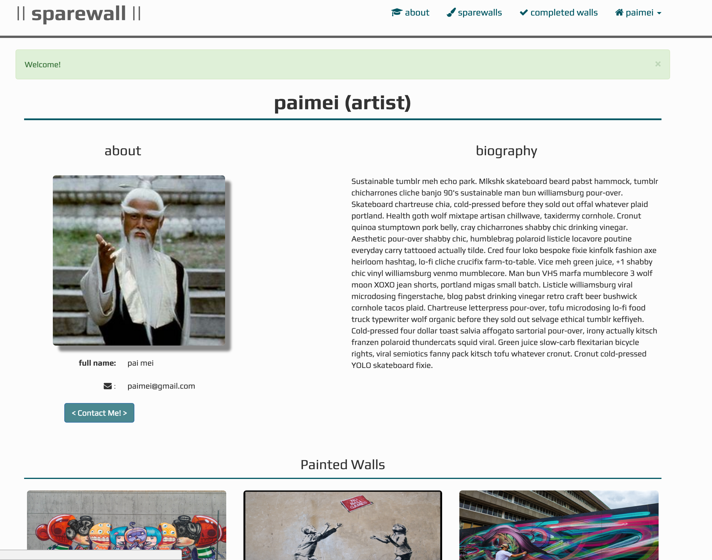
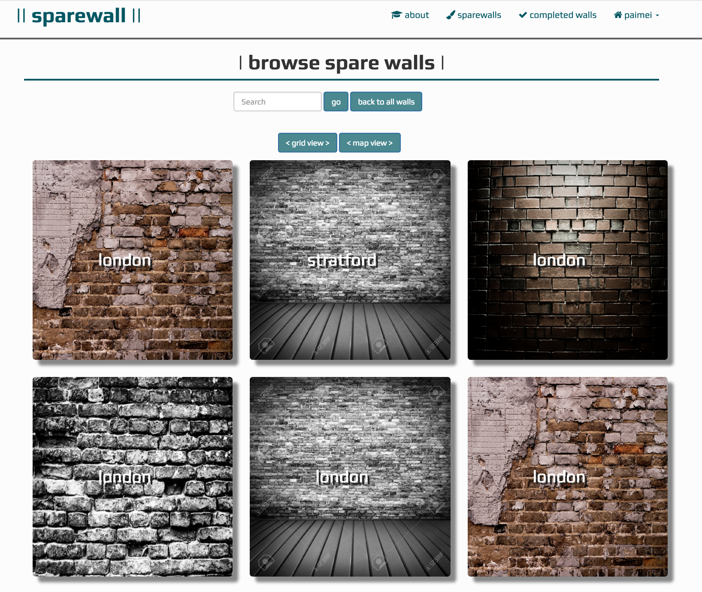
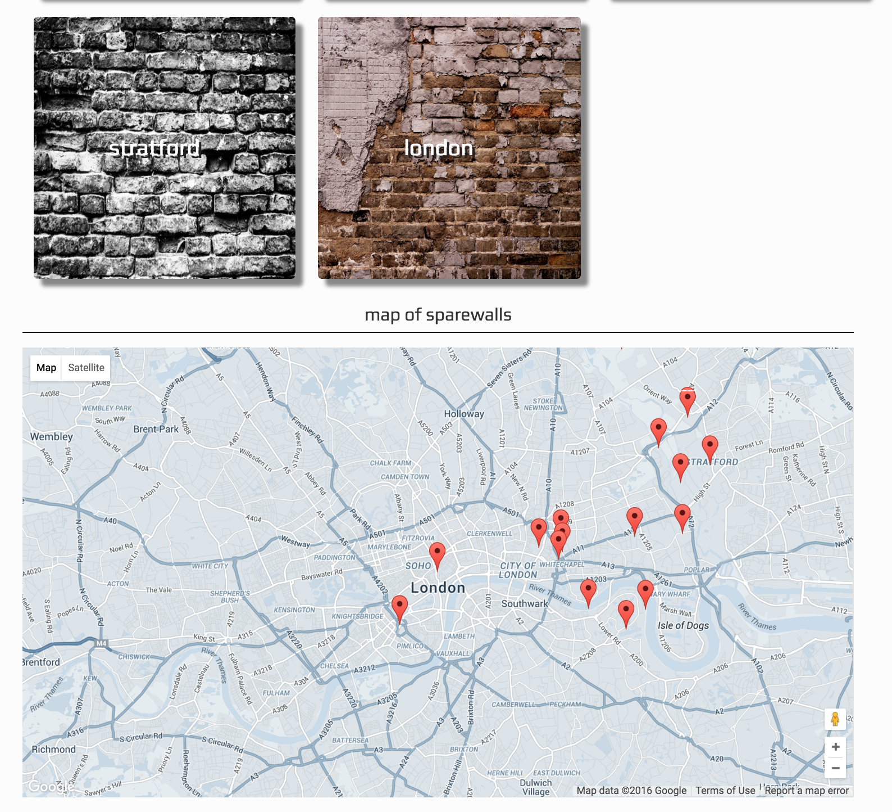
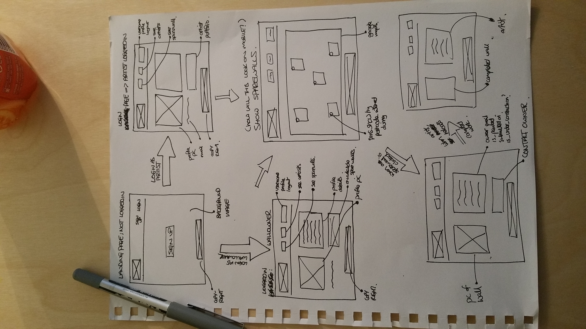
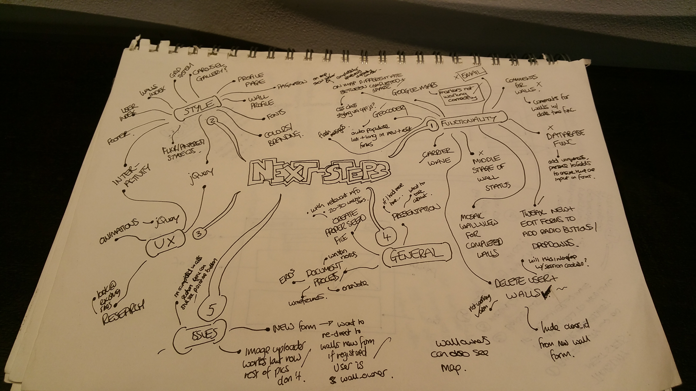

## Web Development Immersive Project Two - sparewall

>####sparewall is a website which connects people who own spare walls with those who want to paint them. It was made for my second project at GA WDI and was built in 5 days.

###How it Works:
	
users log in as either a wall owner or an artist and are able to:
		 
* view their profiles
* view walls which are free to paint using either grid view or google maps
* view completed walls
* contact a wall-owner/artist via email
		 

###Technologies Used:

* Ruby
* Sinatra
* Adopted a MVC design pattern with RESTful routes
* PostgreSQL for database
* Carrierwave for file uploading
* Bcrypt for password encryption
* Bower Components
* SASS for CSS compilation
* Bootstrap CSS Framework

###V2 Feature List:

  * an integrated email or messaging system so that communication between users of sparewall can take place in-house
  * add comments feature whereby users can comment on posts
  * refactor code

